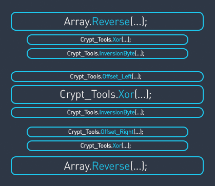

# 🔐 sBurger-256

**A custom symmetric block cipher for .NET with a 256-bit key and substitution-permutation network.**

[](https://github.com/0xLaileb/sBurger-256/releases)
[](https://www.nuget.org/packages/sBurger256)
[](https://www.nuget.org/packages/sBurger256)
[](https://github.com/0xLaileb/sBurger-256/commits)


---

## 📋 Table of Contents

- [📖 About](#-about)
- [✨ Features](#-features)
- [🚀 Getting Started](#-getting-started)
  - [📌 Prerequisites](#-prerequisites)
  - [📦 Installation](#-installation)
- [💡 Usage](#-usage)
- [📚 API Reference](#-api-reference)
- [🧪 Running Tests](#-running-tests)
- [🏗️ Project Structure](#️-project-structure)
- [🤝 Contributing](#-contributing)
- [📄 License](#-license)

---

## 📖 About

**sBurger-256** is a custom symmetric encryption algorithm built as a .NET class library. It uses a **256-bit key** and a **substitution-permutation network** to encrypt and decrypt data in blocks of up to 32 bytes.

The cipher derives internal transformation parameters from the key, then applies a sequence of XOR, bit-rotation, and bit-inversion operations to each byte of the data block.



> ⚠️ **Note:** This is an author's experimental cipher created for educational purposes. It has not been formally audited. Do not use it for protecting sensitive data in production.

---

## ✨ Features

| Characteristic | Value |
|---|---|
| Created | 2020 |
| Key size | 256 bits (32 bytes) |
| Block size | 8 .. 256 bits (1 .. 32 bytes) |
| Rounds | 1 round per byte |
| Type | Substitution-permutation network |

| Capability | Description |
|---|---|
| `Encryption` | Encrypts a data block (1–32 bytes) in place |
| `Decryption` | Decrypts a data block (1–32 bytes) in place |
| `GenerationSettings` | Derives internal cipher parameters from the key |
| `Input validation` | Guards against null, wrong-length keys, and out-of-range data blocks |

---

## 🚀 Getting Started

### 📌 Prerequisites

- **SDK:** [.NET 10 SDK](https://dotnet.microsoft.com/download) or later
- **Language:** C# 14

### 📦 Installation

#### NuGet Package Manager

```
dotnet add package sBurger256
```

Or via the Package Manager Console in Visual Studio:

```
Install-Package sBurger256
```

Or add directly to your `.csproj`:

```xml
<PackageReference Include="sBurger256" Version="2.0.0" />
```

---

## 💡 Usage

```csharp
using System.Security.Cryptography;
using System.Text;

// 1. Create a 256-bit key (e.g. from a passphrase via SHA-256).
byte[] key = SHA256.HashData(Encoding.UTF8.GetBytes("your passphrase"));

// 2. Initialize the cipher and generate settings.
var cipher = new sBurger256.sBurger256 { Key = key };
cipher.GenerationSettings();

// 3. Encrypt a 32-byte block.
byte[] data = Encoding.UTF8.GetBytes("Hello, sBurger-256 cipher test!!");  // 32 bytes
cipher.Encryption(data);
Console.WriteLine($"Ciphertext: {Convert.ToHexString(data)}");

// 4. Decrypt back.
cipher.Decryption(data);
Console.WriteLine($"Plaintext:  {Encoding.UTF8.GetString(data)}");
```

👉 See the full working demo in [`examples/sBurger256.Example/Program.cs`](examples/sBurger256.Example/Program.cs).

---

## 📚 API Reference

### 🔨 Constructor

```csharp
public sBurger256()
```

Creates a new cipher instance. Set the `Key` property and call `GenerationSettings()` before encrypting or decrypting.

### 🏷️ Properties

| Property | Type | Description |
|---|---|---|
| `Key` | `byte[]` | The 256-bit (32-byte) encryption key. Validated on set; internally copied. |

### 📏 Constants

| Constant | Type | Value | Description |
|---|---|---|---|
| `KeyLength` | `int` | `32` | Required key length in bytes. |
| `MaxBlockSize` | `int` | `32` | Maximum data block size in bytes. |

### ⚙️ Methods

#### 🔧 `GenerationSettings`

```csharp
public void GenerationSettings()
```

Derives internal cipher parameters from the current key. Must be called once after setting the key and before any encryption or decryption. Throws `InvalidOperationException` if the key has not been set.

#### 🔒 `Encryption`

```csharp
public byte[] Encryption(byte[] data)
```

Encrypts the data block **in place** and returns the same array. Data length must be between 1 and 32 bytes. Throws `ArgumentException` for invalid length, `InvalidOperationException` if settings were not generated.

#### 🔓 `Decryption`

```csharp
public byte[] Decryption(byte[] data)
```

Decrypts the data block **in place** and returns the same array. Data length must be between 1 and 32 bytes. Throws `ArgumentException` for invalid length, `InvalidOperationException` if settings were not generated.

---

## 🧪 Running Tests

```bash
dotnet test
```

Tests are located in [`tests/sBurger256.Tests/`](tests/sBurger256.Tests/) and use **xUnit**. They cover key validation, roundtrip encryption/decryption, determinism, boundary conditions, and wrong-key scenarios.

---

## 🏗️ Project Structure

```
sBurger-256/
├── 📁 src/
│   ├── 📄 sBurger256.cs              # Library source
│   └── 📄 sBurger256.csproj
├── 📁 tests/
│   └── 📁 sBurger256.Tests/          # xUnit tests
│       ├── 📄 sBurger256Tests.cs
│       └── 📄 sBurger256.Tests.csproj
├── 📁 examples/
│   └── 📁 sBurger256.Example/        # Console demo app
│       ├── 📄 Program.cs
│       └── 📄 sBurger256.Example.csproj
├── 📄 Directory.Packages.props        # Central package management
├── 📄 sBurger256.slnx                 # Solution file
└── 📄 README.md
```

---

## 🤝 Contributing

Contributions are welcome! To get started:

1. 🍴 Fork the repository
2. 🌿 Create a feature branch (`git checkout -b feature/my-feature`)
3. ✏️ Make your changes and add tests
4. ✅ Run `dotnet test` to verify everything passes
5. 📬 Open a Pull Request

---

## 📄 License

This project is licensed under the [MIT License](LICENSE).